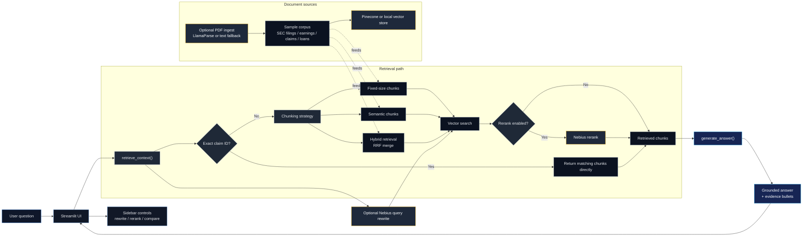

# RAG & Riches Financial

A modular Retrieval-Augmented Generation MVP for financial analysts and investors.

## Overview

This project demonstrates a chat-based financial RAG workflow across:

- SEC filings
- earnings call transcripts
- insurance claims
- loan documents

It compares fixed-size vs semantic chunking, adds an optional reranking step, and includes an embedding benchmark that compares OpenAI vs BGE with Top-K=3 vs Top-K=5.
The repo also ships with an expanded synthetic corpus and benchmark question pack so you can stress-test retrieval, reranking, hybrid RRF, and exact claim-ID lookups.

## Architecture at a glance



## Structure

- `src/rag_and_riches_financial/` - core application modules
- `tests/` - unit tests
- `docs/` - design and implementation plans
- `requirements.txt` - dependencies

## Quick start

1. Create a virtual environment:
   ```powershell
   python -m venv .venv
   .\.venv\Scripts\Activate.ps1
   ```
2. Install dependencies:
   ```powershell
   pip install -r requirements.txt
   ```
3. Run the sample app:
   ```powershell
   python src\app.py
   ```
4. Launch the browser UI:
   ```powershell
   streamlit run src\app.py
   ```

## Notes

The MVP is structured to plug into Pinecone for vector search and Nebius Token Factory for retrieval-time LLM calls.
It starts a background ingestion warmup at app launch so the main query path stays responsive, and the hero header shows when ingestion is warming, done, or failed.
It can also parse additional PDFs from `src/rag_and_riches_financial/data/` with LlamaParse when the `llama-parse` package is installed and a Llama Cloud API key is available.

### Optional environment variables

- `PINECONE_API_KEY`
- `PINECONE_INDEX_NAME`
- `PINECONE_INDEX_HOST`
- `NEBIUS_API_KEY` or `NEBIUS_TOKEN_FACTORY_API_KEY`
- `NEBIUS_BASE_URL`
- `NEBIUS_MODEL`
- `LLAMA_CLOUD_API_KEY` or `LLAMAPARSE_API_KEY`

You can place these values in a local `.env` file in the project root. The app loads `.env` automatically at startup.

If those are not set, the app falls back to its local in-memory demo path.
If the LlamaParse key is set, the parsed PDF docs in `src/rag_and_riches_financial/data/` are added to the corpus automatically.

### Demo modes

- `rewrite` uses Nebius to rewrite the query and skips reranking.
- `rerank` uses Nebius to rewrite the query and optionally rerank candidates.

In the Streamlit sidebar, retrieval mode is still configurable, but the app now always compares fixed-size vs semantic chunking side by side for the same question.

Compare mode shows fixed-size vs semantic chunking side by side so you can see how the two strategies differ on the same question.
The retrieval benchmark section compares fixed vs semantic retrieval on the same curated query set and shows the effect of reranking on each strategy.
You can also enable the embedding benchmark to see a four-row table for OpenAI vs BGE and Top-K=3 vs Top-K=5 on the same query.

The UI includes your `Vault_Mind.png` logo in the sidebar, scaled to fit the layout.

### Demo questions

The app includes preset demo questions in the sidebar for quick walkthroughs. Good starting points are:

- liquidity and covenant pressure
- margin pressure and revenue momentum
- claim reserve adjustments
- insurance fraud screening and settlement notes
- SEC compliance and internal controls
